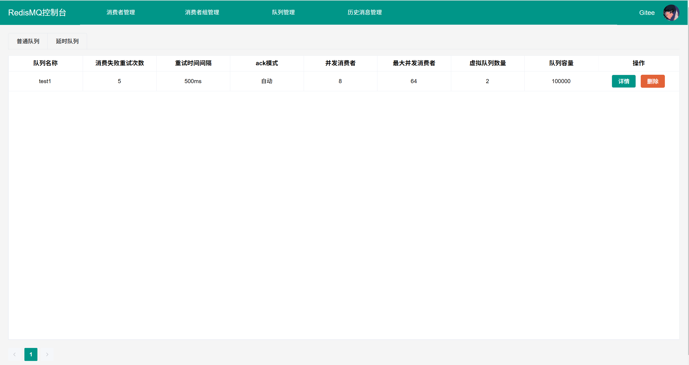

## 什么是 Redis-MQ

Redis-MQ 是利用redis实现mq的功能的中间件

## 特点

- **无侵入延时队列**：无需任何配置和额外的插件即可使用延时队列 
- **兼容spring事务和seata事务**：支持消息在事务提交后发送
- **优雅的api封装**:  对外暴露的api及其简单易用
- **支持消息的负载均衡**：通过redis定时轮询注册心跳
- **支持顺序消息**： 只需要把消费者和虚拟队列都设置为1
- **支持定时消息**： 可以让消息在指定时间执行
- **支持生产者消费者回调**： 消息发送结果通过回调通知用户
- **启动监控控制台**：方便对消息进行监控。同mq-server端，可对消息进行持久化管理
- **消费者组机制**: 增加了类似rocketmq和kafka的消费者组机制 不同消费者组消费同一份消息。需要依赖redisMQ-server端 - 0.5.0新特性

## 文档地址
[详细文档](https://zhaohaoh.github.io/redismq-docsify/#/)
### 0.4.4是没有加入消费者组前最后一个稳定可靠的版本.
因为引入消费者组和0.5.0版本redis结构不兼容，如果需要线上平滑迁移需要联系我。
## 注意事项
队列名称存储在redis中。如果一个队列无用了。需要去redis控制台中手动删除，否则也没影响，就是占用redis空间。group消费者组同理 。
web控制台内置消费者组和队列的管理功能，目前已经完善。
0.5.0开始redis操作客户端升级为redisson   该版本设置beta欢迎有需求的伙伴来测试

## 引入
0.4.4是没有加入消费者组前最后一个稳定可靠的版本.  如果你希望使用消费者组功能。0.5.0-beta2是已经经过测试的一个相对稳定的版本
``` xml
      <dependency>
            <groupId>io.github.zhaohaoh</groupId>
            <artifactId>redismq-spring-boot-starter</artifactId>
            <version>0.5.0-beta2</version>
        </dependency>
        <dependency>
            <groupId>io.github.zhaohaoh</groupId>
            <artifactId>redismq-spring-boot3-starter</artifactId>
            <version>0.5.0-beta2</version>
        </dependency>
```


## 快速开始
### application.peoperties redisMQ客户端配置 引入redismq-spring-boot-starter的工程

```properties
#指定环境隔离的命名空间 可参考nacos设计
spring.redismq.namespace=default
# 指定redismq应用名
#spring.redismq.application-name=${spring.application.name}
spring.redismq.application-name=redisMQ-cliet
# redismq客户端redis的host
spring.redismq.client.host=localhost
#默认的database
spring.redismq.client.database=6
#redis的端口
spring.redismq.client.port=6379
#redis的账号和密码
spring.redismq.client.username=你的用户
spring.redismq.client.password=你的密码
#虚拟队列数量默认是1，单机redis配多了没有意义。 分布式环境可以根据消费者节点数配置提高并发度
spring.redismq.queue-config.virtual=1
#默认值true 事务提交后发送
spring.redismq.global-config.send-after-commit=true
#如果有seata事务需要开启 默认值false
spring.redismq.global-config.seata-state=false
#默认单个虚拟队列消息堆积上限值 10W
spring.redismq.global-config.queueMaxSize=100000
#消费者分组id 想要完善的消费者组偏移量功能需要部署服务端。  不同消费者配置不同的消费者之间会消费同一份消息。偏移量相互隔离
spring.redismq.consumser-config.group-id=consumerGroup

# ---------进阶版配置。MQ消息持久化到mysql（目前只有这个）或者文件。
# ----------需要增加了服务端的部署。没有下面配置redismq依然可以使用。消息持久化依赖redis。但是没有历史消息回溯和消费者组从0偏移量开始消费的功能。
##server端的端口 默认10520
spring.redismq.netty-config.server.port=10520
#server端的地址 如果客户端和服务器端在相同主机，可不填，会自动获取ip
spring.redismq.netty-config.server.host=XXX
#是否开启客户端   开启此配置客户端会向服务器发送消息持久化。  目前持久化机制使用mysql。
spring.redismq.netty-config.client.enable=true
```

### 部署redismqServer服务器端(包含控制台功能,未解耦)
application.properties  
```properties
server.servlet.context-path=/
#配置当前服务器的名称DynamicRoutingDataSource
spring.application.name=redismq-server
#解决springboot2.6.3 接口不显示的问题。路径匹配变更了方式
spring.mvc.pathmatch.matching-strategy=ant_path_matcher
spring.jackson.date-format=yyyy-MM-dd HH:mm:ss
spring.jackson.time-zone=GMT+8
##你的端口
server.port=8088
#指定环境隔离的命名空间
spring.redismq.namespace=你的命名空间
# 你的redis地址
spring.redismq.client.host=localhost
#默认的database
spring.redismq.client.database=6
#redis的端口
spring.redismq.client.port=6379
#redis的账号和密码
spring.redismq.client.username=你的用户
spring.redismq.client.password=你的密码
spring.web.resources.static-locations=classpath:/static/
#此配置代表是否启用tcp服务端
spring.redismq.netty-config.server.port=10520
spring.redismq.netty-config.server.enable=true
```

本地启动redismq-server项目或者部署到服务器均可  如果是本地部署可访问http://localhost:8088

#### 效果展示


### 案例代码

```java
/**
 * @Author: hzh
 * @Date: 2022/12/26 17:54
 * 生产消息的例子
 */
@RestController
@RequestMapping("producer")
public class ProducerController {
    @Autowired
    private RedisMQTemplate redisMQTemplate;

    /**
     * 发送延迟消息
     */
    @PostMapping("sendDelayMessage")
    public void sendDelayMessage() {
        redisMQTemplate.sendDelayMessage("延时消息消费", "delaytest1", Duration.ofSeconds(60));
    }


    /**
     * 发送普通消息
     */
    @PostMapping("sendMessage")
    public void sendMessage() {
        redisMQTemplate.sendMessage("普通消息消费", "test1");
    }

    /**
     * 发送顺序消息
     */
    @PostMapping("sendOrderMessage")
    public void sendOrderMessage() {
        redisMQTemplate.sendMessage("顺序消息消费", "order");
    }

    /**
     * 发送定时消费消息 带tag
     */
    @PostMapping("sendTimingMessage")
    public void sendTimingMessage() {
        LocalDateTime time = LocalDateTime.of(2022, 12, 26, 14, 20, 30);
        long l = time.toInstant(ZoneOffset.ofHours(8)).toEpochMilli();
        redisMQTemplate.sendTimingMessage("定时消息消费", "time", "bussiness1", l);
    }


    /**
     * 发送定时消费消息 带tag
     */
    @PostMapping("sendMultiTagMessage")
    public void sendMultiTagMessage() {
            redisMQTemplate.sendMessage("多个标签同一topic消息消费1", "MultiTag", "bussiness1");
            redisMQTemplate.sendMessage("多个标签同一topic消息消费2", "MultiTag", "bussiness2");
            redisMQTemplate.sendMessage("多个标签同一topic消息消费1", "MultiTag", "bussiness1");
            redisMQTemplate.sendMessage("多个标签同一topic消息消费2", "MultiTag", "bussiness2");
            redisMQTemplate.sendMessage("多个标签同一topic消息消费1", "MultiTag", "bussiness1");
            redisMQTemplate.sendMessage("多个标签同一topic消息消费2", "MultiTag", "bussiness2");
            redisMQTemplate.sendMessage("多个标签同一topic消息消费1", "MultiTag", "bussiness1");
            redisMQTemplate.sendMessage("多个标签同一topic消息消费2", "MultiTag", "bussiness2");
    }
}

```


```java
/**
 * @Author: hzh
 * @Date: 2022/12/26 17:54
 * 消费者简单案例
 */
@Component
public class SamplesConsumer {


    /**
     * delaytest1消费延时队列
     */
    @RedisListener(queue = "delaytest1", delay = true)
    public void delaytest1(String test) {
        System.out.println(test);
    }

    /**
     * 普通消息消费
     */
    @RedisListener(queue = "test1")
    public void test1(String test) {
        System.out.println(test);
    }

    /**
     * 顺序消息消费  虚拟队列，消费者线程都设置为1即可保证顺序
     */
    @RedisListener(queue = "order", virtual = 1, concurrency = 1, maxConcurrency = 1)
    public void order(Message message) {
        System.out.println(message);
    }

    @RedisListener(queue = "time",tag = "bussiness1",delay = true)
    public void time(Message message) {
        System.out.println(message);
    }


    /**
     * 多标签同topic消费，会由同一个线程池进行消费
     *
     * @param message 消息
     */
    @RedisListener(queue = "MultiTag",tag = "bussiness1")
    public void multiTag1(Message message) {
        //模拟业务消费
        try {
            Thread.sleep(1000L);
        } catch (InterruptedException e) {
            e.printStackTrace();
        }
        String name = Thread.currentThread().getName();
        System.out.println(name+message);
    }

    @RedisListener(queue = "MultiTag",tag = "bussiness2")
    public void multiTag2(Message message) {
        //模拟业务消费
        try {
            Thread.sleep(1000L);
        } catch (InterruptedException e) {
            e.printStackTrace();
        }
        String name = Thread.currentThread().getName();
        System.out.println(name+message);
    }
}
```
### 如何处理消息堆积
由于内存队列的特性，无法堆积消息(消息累积到一定数量会拒绝)。因此框架提供了发送消息的生产者前后回调和消费者前后回调。
默认消费失败加入redis的死信队列
默认生产发消息失败打印失败日志
可自定义实现对消息持久化mysql等第三方存储库 （该功能本框架已实现，只需开启服务端，每次发消息前会异步持久化消息到mysql。即使消息丢失，也可从mysql中回溯）
框架默认限制了单个队列的消息数量最大size=600000  可根据redis内存配置自行增大缩小
```java
@Configuration
public class RedisMQInterceptorConfiguration {
    
    @Bean 
    public ConsumeInterceptor redisDeadQueueHandleInterceptor() {
        return new 自定义ConsumeInterceptor实现类();
    }
    
    @Bean 
    public ProducerInterceptor producerInterceptor() {
        return new 自定义ProducerInterceptor实现类();
    }
}
```

## 作者
加好友进群聊，问题及时响应！一手更新资料！ 开源不易,如果你也喜欢本框架。你的star就是我的动力


## 可靠性及稳定性测试
实测下单系统TPS30 压测一小时以上。消息稳定处理。
延时队列单台机器并发消费处理1W条消息 延时低于1000ms

## 版本更新记录
0.5.0-beta版本 增加消费者组机制-参考rocket， redis底层客户端操作切换为redisson
0.4.4 修复0.4.3的严重bug
0.4.3 1.修复事务提交后发消息
      2.修复消息异步入库索引失效问题
      3.修复和spring框架部分冲突问题
感谢 什么风把你吹来了 提供的信息。
0.4.2 多客户端topic负载问题 重要！
0.4.1 增加消息持久化机制


# 版权 | License
[Apache License 2.0](https://www.apache.org/licenses/LICENSE-2.0)


